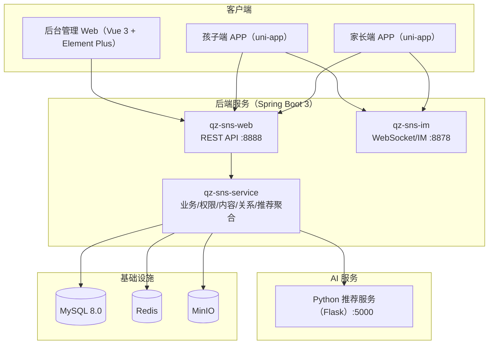

# AI阅桥亲子阅读平台（AI-based Parent-Child Reading Application）

面向家庭场景的亲子阅读与互动平台：提供家长端与孩子端 APP、后台管理系统、Spring Boot 后端服务，并包含一套可独立运行的 Python 推荐服务（BERT 表征 + 多策略融合 + Redis 缓存）。
本项目为**江苏师范大学人工智能学院**大创项目，已申请**软件著作权**。
<p align="center">

</p>
<p align="center">
  <a href="https://www.java.com/"></a>
  <a href="https://spring.io/projects/spring-boot"></a>
  <a href="https://vuejs.org/"></a>
  <a href="https://uniapp.dcloud.net.cn/"></a>
  <a href="https://www.mysql.com/"></a>
  <a href="https://redis.io/"></a>
  <a href="https://min.io/"></a>
  <a href="./docs/screenshots.md"></a>
</p>

<p align="center">
  <a href="#-快速开始本地开发">快速开始</a> ·
  <a href="#-系统架构">系统架构</a> ·
  <a href="#-推荐系统pythonflask">推荐系统</a> ·
  <a href="#-系统截图">系统截图</a> ·
  <a href="./docs/screenshots.md">更多截图</a>
</p>

## 🧭 目录

- [项目亮点](#-项目亮点)
- [核心功能](#-核心功能)
- [系统架构](#-系统架构)
- [仓库组成](#-仓库组成)
- [技术栈](#-技术栈)
- [服务与端口](#-服务与端口)
- [快速开始（本地开发）](#-快速开始本地开发)
- [推荐系统（Python/Flask）](#-推荐系统pythonflask)
- [系统截图](#-系统截图)
- [贡献](#-贡献)
- [License](#-license)

## 📌 项目亮点

- **多端一体**：家长端/孩子端 APP + 管理后台 + 后端服务，覆盖“使用端 + 运营端”
- **可扩展后端**：Spring Boot 3 多模块工程，业务、模型、IM、Web 分层清晰
- **内容存储与分发**：MinIO 统一承载图文/文件/视频对象存储（便于扩容与迁移）
- **推荐可独立部署**：Python 推荐服务可单独运行，Java 侧通过 HTTP/服务层接入
- **工程化落地**：包含数据库脚本与多份运维/存储方案文档，适合课程/竞赛/科研项目复用

## ✨ 核心功能

- **亲子阅读**：图文内容浏览、阅读模式、历史记录、收藏与互动
- **亲子关系**：家庭绑定、亲密度与排行榜、成长/勋章体系（以项目实现为准）
- **社交与沟通**：私聊/群聊、好友申请、群组管理、WebSocket 实时通信
- **内容体系**：图文与视频内容的上传、管理与分发（MinIO 存储）
- **后台管理**：用户、内容、评论、群组、问卷与数据看板等管理能力
- **AI 能力**：
  - **推荐**：多策略推荐（历史/热门/内容相似等）与去重、冷启动、日志落库
  - **对话**：后端预留大模型接入配置（以实际部署的模型与密钥为准）

## 🧱 系统架构



## 🧩 仓库组成

本仓库为多模块/多子项目结构：

- **APP 前端（家长端/孩子端，uni-app）**：`./frontend-unified`
- **后台管理（Vue 3 + Element Plus + Vite）**：`./Houtaiguanli`
- **后端服务（Spring Boot 3，多模块 Maven）**：`./qz-sns-app`
  - `qz-sns-web`：HTTP API（默认 `:8888`）
  - `qz-sns-service`：业务服务层、MyBatis-Plus、MinIO、Redis 等
  - `qz-sns-im`：IM/WS 服务（默认 `:8878`）
- **推荐系统（Python/Flask，可独立部署）**：`./qz_sns推荐系统`
- **数据库初始化**：`./qz_sns.sql`

## 🛠️ 技术栈

- **移动端**：uni-app（Vue 3）、Vite、uView、ECharts、TinyMCE
- **后台管理**：Vue 3、Vite、Element Plus、Pinia、Axios、ECharts、TinyMCE
- **后端**：Spring Boot 3.3.x、Java 17、MyBatis-Plus、Redis、MinIO、WebSocket、Knife4j(OpenAPI)
- **推荐服务**：Flask、PyMySQL、Redis、scikit-learn、PyTorch、Transformers（BERT）
- **基础设施**：MySQL 8.0、Redis、MinIO

## 🔌 服务与端口

| 服务 | 目录 | 默认端口 | 说明 |
|---|---|---:|---|
| 后端 API | `qz-sns-app/qz-sns-web` | 8888 | REST API、Knife4j 文档 |
| IM/WS | `qz-sns-app/qz-sns-im` | 8878 | WebSocket/即时通信 |
| 推荐服务（可选） | `qz_sns推荐系统` | 5000 | Flask 推荐/热门/健康检查 |
| 后台管理 | `Houtaiguanli` | 5173 | Vite 开发服务器 |
| uni-app H5（可选） | `frontend-unified` | 由 CLI 输出 | `npm run dev:h5` |

## 🧠 推荐系统（Python/Flask）

推荐服务支持独立部署，并通过后端聚合接口接入：

- Python 服务默认地址：`http://localhost:5000`
- 后端推荐聚合接口：`/api/recommendation/*`
  - `/api/recommendation/get`：获取推荐内容
  - `/api/recommendation/hot`：热门内容（冷启动/兜底）
  - `/api/recommendation/updateBehavior`：用户行为更新（用于缓存失效等）
  - `/api/recommendation/check`：健康检查（同时检测 DB 与 Python 服务）

推荐实现侧重点：

- 多策略融合（历史、热门、相似等）与推荐去重
- Redis 缓存与最近推荐过滤，降低重复推荐与接口延迟
- 推荐日志落库，便于离线分析与效果评估
  

## 🚀 快速开始（本地开发）

> 建议按“后端 →（可选）推荐服务/IM → 前端”顺序启动。

### 1）准备依赖

- JDK 17、Maven 3.9+
- Node.js：后台管理建议 Node >= 16；uni-app 参考 `frontend-unified/package.json`
- MySQL 8.0、Redis、MinIO（可用 Docker 或本机服务）

### 2）启动后端（Spring Boot）

```bash
cd qz-sns-app
mvn -pl qz-sns-web -am spring-boot:run
```

- 默认地址：`http://localhost:8888`
- 接口文档（Knife4j）：`http://localhost:8888/doc.html`
- 关键配置：
  - `qz-sns-app/qz-sns-web/src/main/resources/application.yml`
  - `qz-sns-app/qz-sns-web/src/main/resources/application-dev.yml`

### 3）（可选）启动 IM/WS 服务

```bash
cd qz-sns-app
mvn -pl qz-sns-im -am spring-boot:run
```

默认 WebSocket 端口：`8878`（以配置文件为准）。

### 4）（可选）启动 Python 推荐服务

```bash
cd qz_sns推荐系统
python -m venv .venv
.\.venv\Scripts\activate
pip install -r requirements.txt
python app.py
```

服务启动后默认监听：`http://localhost:5000`，可用 `/health` 做健康检查。

### 5）启动后台管理（管理员端）

```bash
cd Houtaiguanli
npm install
npm run dev
```

默认访问：`http://localhost:5173`。后端地址通过 `VITE_API_URL` 配置（详见 [README_CN.md](./Houtaiguanli/README_CN.md)）。

### 6）启动 APP 前端（uni-app）

```bash
cd frontend-unified
npm install
npm run dev:h5
```

APP 项目推荐使用 HBuilderX 打开并运行到 App/小程序等平台；请求基地址在 [request.js](./frontend-unified/utils/request.js) 中配置（默认 `http://localhost:8888`）。

## ⚙️ 配置与安全说明

- **数据库/Redis/MinIO**：默认配置集中在 Spring Boot 的 `application*.yml` 中；你可以按环境拆分为 dev/test/prod 并覆盖敏感项。
- **第三方密钥**：短信、邮箱、AI 模型等密钥请使用环境变量或私有配置文件注入，避免提交到公开仓库。
- **存储方案**：仓库 `./docs` 目录中包含图文/视频存储方案与运维说明（以实际文档为准）。

## 📷 系统截图

<table align="center">
  <tr>
    <td></td>
    <td></td>
    <td></td>
    <td></td>
  </tr>
  <tr>
    <td></td>
    <td></td>
    <td></td>
    <td></td>
  </tr>
</table>

由于页面众多，点击查看更多截图：

👉 [Screenshots](./docs/screenshots.md)

## 🤝 贡献

- 欢迎通过 Issue/PR 提交问题与改进建议
- 提交前建议：格式化代码、补充必要的测试用例与接口说明

## 📄 License

本项目采用 **Apache License 2.0** 开源发布，详见 [LICENSE](./LICENSE)。
